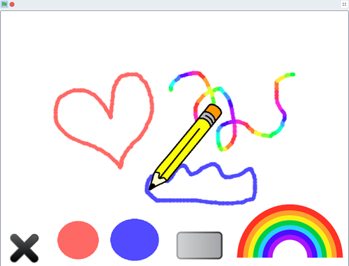
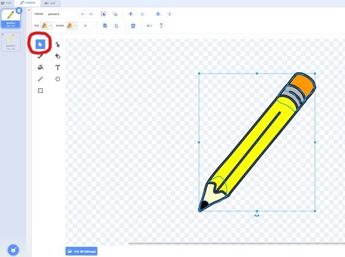
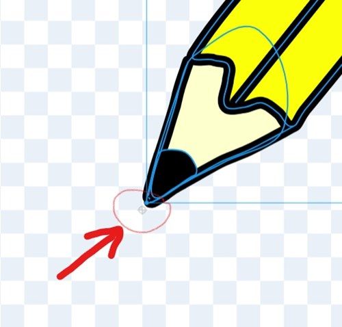
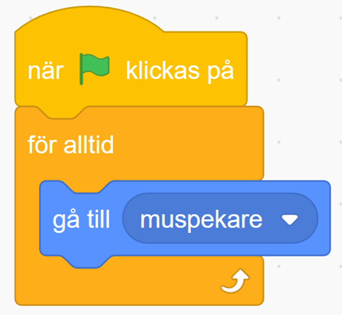
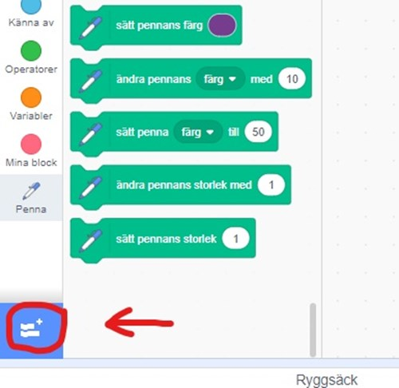
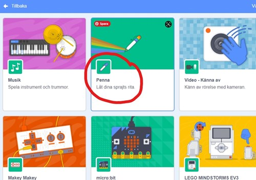
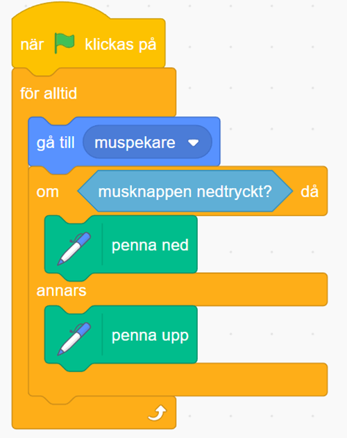

# Ritprogram del 1

**Här kodar du Ritprogrammet Del 1.**

**Öppna kodarverktyget Scratch och logga in på ditt scratchkonto genom att gå till <a href="https://www.scratch.mit.edu" target="_blank">ww.scratch.mit.edu</a>**

 

**I videon ovan guidar pedagoger från Kodcentrum dig igenom uppgiften. Scrolla dig igenom instruktionerna nedan steg för steg.**

**Ok, då kör vi igång! Du börja så här:**

## 1: En penna som kan rita.

1. Skapa ett nytt Scratch-projekt och ta bort katten. Välj en ny *sprajt*: Sök på *Pencil* och lägg till den.
 
2. Gå till fliken *Klädslar*. Vi ska nu flytta pennans spets till *sprajtens centrum.* **Det är viktigt för att pennan ska kunna rita från spetsen.** Detta kan vara lite knepigt men du gör så här:
 
3. Klicka på verktyget *"Välj"* som ser ut som en vit pil. Markera nu *sprajten* genom att klicka med muspekaren längst upp i vänstra hörnet på ritytan. Håll in knappen på muspekaren och dra ut en rektangel som *täcker hela sprajten* och släpp sedan knappen på muspekaren.

4. Nu är hela *sprajten* markerad och du kan nu flytta hela *sprajten* utan att den går sönder. Flytta pennan så att spetsen hamnar precis ovanför det ljusgrå korset. **Titta på bilderna så ser du hur pennan ska placeras.**

 

5. Skapa ett skript för pennan som säger:  

* Starta när Start-flaggan klickas på  
* För alltid gå till muspekaren
 
 

Nu vill du kunna använda *sprajten* som en riktig penna, där du kan styra med musen och rita genom att trycka ned musknappen. För att kunna göra det måste du lägga till ett *tillägg.* Det gör du genom att klicka längst ned till vänster på **Lägg till ett tillägg.**  

Sedan kan du klicka på kategorin **Penna,** här finns alla block som har att göra med att kunna rita.  

6. Skapa ett skript som säger att när musknappen är nedtryckt ska pennan vara nere, annars ska pennan vara uppe. Lägg ett **KONTROLL-block** i ditt första skript, som säger att:  

* **OM** musknappen **är nedtryckt** ska **penna** vara **ned.**  
* **ANNARS** ska **penna** vara **upp.** 

**Testa ditt projekt!** Klicka på START. Följer pennan muspekaren? Vad händer om du håller nere musknappen och flyttar musen? (Tänk inte på vilken färg pennan har, det kommer du fixa till senare!) 

**Glöm inte att spara ditt projekt! Döp det gärna till uppgiftens namn så att du enkelt kan hitta den igen.**
 
Detta var instruktionerna för **del 1 av Ritprogrammet.** Vi har nu skapat början till vårt ritprogram! Vi har nu en penna som vi kan rita med. Men vi vill ju kunna sudda och byta till fler färger? **Det ska vi fixa i del 2 av Ritprogrammet!**
