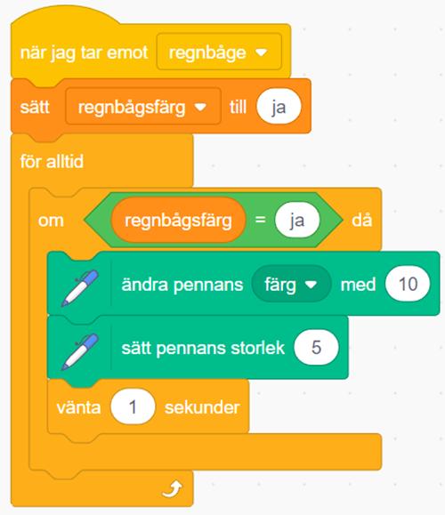

# Ritprogram del 3

**Här kodar du Ritprogrammet Del 3.**

**Öppna kodarverktyget Scratch och logga in på ditt scratchkonto genom att gå till <a href="https://www.scratch.mit.edu" target=" blank">ww.scratch.mit.edu</a>**

**I videon ovan guidar pedagoger från Kodcentrum dig igenom uppgiften. Titta på videon och klicka dig vidare igenom instruktionerna på Kodboken steg för steg.**

**Ok, då kör vi igång! Du börja så här:**

## 4: Skapa en regnbågspenna

**Nu ska vi programmera så att penna kan måla i regnbågens alla färger samtidigt istället för bara med en färg.**

23. Välj en ny *sprajt.* Sök efter *sprajten* **"Rainbow"** och lägg till den i projektet. Ändra storleken på *sprajten* om du vill.  

24. Ta tag i *sprajten* och placera den längst ner på scenen intill dina andra knappar.  

25. Ändra namn på *sprajten* till **"Regnbåge".**

26. Skapa ett *skript* för sprajten **"Regnbåge"** som säger:  

* När denna **sprajt klickas på**
* **Skicka** meddelande **"regnbåge"**

Nu ska du programmera vad pennan ska göra när den tar emot meddelandet **"regnbåge"**

27. Klicka på *sprajten* **"Pencil".**

28. Skapa nu ett nytt *skript* för *sprajten* **"Pencil"** som säger:  

* Starta när den **tar emot meddelandet "regnbåge"**
* **För alltid**
* **Ändra pennans färg med 10**
* **Sätt pennans storlek till 5**

> **Testa ditt projekt!** Byter pennan färg när du målar? Tycker du att färgbytet sker för snabbt? Det kan du ändra genom att lägga till en paus.

29. Dra ut blocket **"Vänta i sekunder"** från kategori **Kontroll.** Placera blocket inuti i **"För alltid-loopen"** och under blocket **"Sätt pennans storlek till 5".**

## 5: Skapa ett suddgummi

**Det är kul att kunna rita, men alla gör misstag och då kanske du vill kunna sudda? Nu ska du lägga till ett verktyg som ser ut att sudda, men som egentligen ritar med bakgrundsfärgen.**

30. Välj en ny *sprajt* för suddgummi, till exempel *sprajten* **Button3.** Förminska den om det behövs och placera i knappraden. Ändra namnet till **"sudd".**

31. Gör ett *skript* för **sprajten** som säger: 

* Starta **när sprajten klickas på**
* **Skicka** meddelandet **"sudd"**

32. Skapa ett nytt *skript* för sprajten **"Pencil"** som säger:

* Starta när den **tar emot meddelandet "sudda"**
* **Sätt pennans färg till samma färg som bakgrunden.**
* **Sätt pennans storlek till en större storlek – testa dig fram vad som passar för suddet!**

33. Klicka på *sprajten* **"Pencil"**

34. Kopiera ditt *skript* för **"När jag tar emot meddelande Röd"** genom att högerklicka på *skriptet* och välj kopiera. Placera ditt nya skript på *skript-ytan.*

35. Ändra meddelandet genom att klicka på den lilla vita pilen och välj meddelandet *"sudda".*

36. Ändra färgen i blocket **"Sätt pennans färg till _ "** genom att klicka på färgrutan. Välj verktyget **"pipett".** Plocka upp den vita bakgrundsfärgen på scenen – **viktigt att det blir rätt färg för att programmet ska fungera!**

37. Ändra siffran i blocket **"Sätt pennans storlek 5",** från 5 till **50.**

## 6: Kontrollera regnbågspennan

**Nu när vi har gjort vårt suddgummi kommer vi att stöta på ett problem i vårt projekt - regnbågsfärgen vill måla hela tiden?! Hur får vi den att sluta och bara måla när vi trycker på regnbågsknappen? Jo, med hjälp av ett **villkor** och med en **variabel.** Vi behöver helt enkelt skapa en **regel** som talar om för vår penna när den får måla med regnbågsfärgen och när den inte ska göra det.**

Först så ska vi skapa en **variabel.** Du kan tänka att den kommer att fungera lite som ett trafikljus för pennan som kommer att säga ja eller nej om pennan får måla.

38. Klicka på *sprajten* **"Pencil".**

39. Från tema VARIABLER. Välj blocket **"Sätt min variabel till 0"** och placera blocket under **"När jag tar emot meddelande regnbåge"** Se till att blocket är ovanför för alltid loopen.

40. Från tema KONTROLL. Välj blocket **"Om_Då".** Placera blocket inuti **"För alltid-loopen"** och låt den "äta upp" övriga block.

41. Från tema OPERATORER. Välj blocket **"_=50".** Placera blocket i diamantformen i **"Om_Då-blocket".**

42. Från tema VARIABLER. Välj blocket **"Regnbågsfärg".** Placera blocket i den tomma cirkeln i operator-blocket.

43. Ändra siffran **50** och skriv med text **ja** där istället.

44. Från tema VARIABLER. Välj blocket **"Sätt min variabel till 0"** och placera blocket under varje *skript* för varje färg. Ändra siffran **0** och skriv med text **nej** där istället.

> **Testa ditt projekt!** Fungerar det nu? Men vad händer nu när du använder suddgummit och sedan trycker på regnbågsfärgen?

Anledningen till att inte fungerar är för att färgen börjar på vit och att ändringen från vit till en starkare nyans sker långsamt så att det nästan inte syns. För att fixa detta behöver vi sätta en startfärg när vi klickar på regnbågen.

45. Från tema PENNA välj blocket. **"Sätt pennans färg till_".** Placera blocket under **"När jag tar emot regnbåge."** Ändra färgen och plocka upp en valfri färg på regnbågen.

**Färdig!**

**Grattis, nu har du gjort klart uppgiften!**

**Glöm inte att spara ditt projekt! Döp det gärna till uppgiftens namn så att du enkelt kan hitta den igen.**

> **Testa ditt projekt**
Visa gärna någon det som du har gjort och låt dem testa. Tryck på DELA för att andra ska kunna hitta spelet på Scratch. Gå ut till projektsidan och låt någon annan testa ditt coola ritprogram!